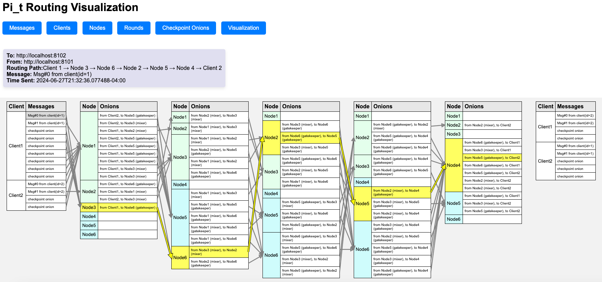

# Implementing $\Pi_t$

<!-- TOC -->
<details>
  <summary><h4><i>Table of Contents</i></h4></summary><br>
  <details><summary>&nbsp;&nbsp;&nbsp;&nbsp;<a href="#roadmap">1. &nbsp;Roadmap</a></summary><br>
    <details><summary>&nbsp;&nbsp;&nbsp;&nbsp;&nbsp;&nbsp;&nbsp;&nbsp;<a href="#completed-tasks">Completed Tasks:</a></summary><br>
      &nbsp;&nbsp;&nbsp;&nbsp;&nbsp;&nbsp;&nbsp;&nbsp;&nbsp;&nbsp;&nbsp;&nbsp;&nbsp;&nbsp;&nbsp;&nbsp;<a href="#crypto-functions-key">i. Crypto Functions</a><br><br>
      &nbsp;&nbsp;&nbsp;&nbsp;&nbsp;&nbsp;&nbsp;&nbsp;&nbsp;&nbsp;&nbsp;&nbsp;&nbsp;&nbsp;&nbsp;&nbsp;<a href="#core-logic">ii. Core Logic</a><br><br>
      &nbsp;&nbsp;&nbsp;&nbsp;&nbsp;&nbsp;&nbsp;&nbsp;&nbsp;&nbsp;&nbsp;&nbsp;&nbsp;&nbsp;&nbsp;&nbsp;<a href="#metric-collection">iii. Metric Collection</a><br><br>
      &nbsp;&nbsp;&nbsp;&nbsp;&nbsp;&nbsp;&nbsp;&nbsp;&nbsp;&nbsp;&nbsp;&nbsp;&nbsp;&nbsp;&nbsp;&nbsp;<a href="#testing-test_tube">iv. Testing</a><br><br>
      &nbsp;&nbsp;&nbsp;&nbsp;&nbsp;&nbsp;&nbsp;&nbsp;&nbsp;&nbsp;&nbsp;&nbsp;&nbsp;&nbsp;&nbsp;&nbsp;<a href="#documentation-blue_book">v. Documentation</a></details>
    <details><summary>&nbsp;&nbsp;&nbsp;&nbsp;&nbsp;&nbsp;&nbsp;&nbsp;<a href="#todo-pending-tasks">Pending Tasks</a></summary><br>
      &nbsp;&nbsp;&nbsp;&nbsp;&nbsp;&nbsp;&nbsp;&nbsp;&nbsp;&nbsp;&nbsp;&nbsp;&nbsp;&nbsp;&nbsp;&nbsp;<a href="#client-side-bust_in_silhouette">i. Client-Side</a><br><br>
      &nbsp;&nbsp;&nbsp;&nbsp;&nbsp;&nbsp;&nbsp;&nbsp;&nbsp;&nbsp;&nbsp;&nbsp;&nbsp;&nbsp;&nbsp;&nbsp;<a href="#node-side-computer">ii. Node-Side</a><br><br>
      &nbsp;&nbsp;&nbsp;&nbsp;&nbsp;&nbsp;&nbsp;&nbsp;&nbsp;&nbsp;&nbsp;&nbsp;&nbsp;&nbsp;&nbsp;&nbsp;<a href="#adversary-simulation-trollface">iii. Adversary Simulation</a></details></details>
  &nbsp;&nbsp;&nbsp;&nbsp;&nbsp;&nbsp;&nbsp;&nbsp;<a href="#introduction">2. &nbsp;Introduction</a><br><br>
  &nbsp;&nbsp;&nbsp;&nbsp;&nbsp;&nbsp;&nbsp;&nbsp;<a href="#background">3. &nbsp;Background</a><br><br>
  <details><summary>&nbsp;&nbsp;&nbsp;&nbsp;<a href="#pi_t-implementation-overview">4. &nbsp;&Pi;<sub>t</sub> Implementation Overview</a></summary><br>
    &nbsp;&nbsp;&nbsp;&nbsp;&nbsp;&nbsp;&nbsp;&nbsp;&nbsp;&nbsp;&nbsp;&nbsp;<a href="#parameters">Parameters</a><br><br>
    &nbsp;&nbsp;&nbsp;&nbsp;&nbsp;&nbsp;&nbsp;&nbsp;&nbsp;&nbsp;&nbsp;&nbsp;<a href="#no-global-clock">No Global Clock</a><br><br>
    &nbsp;&nbsp;&nbsp;&nbsp;&nbsp;&nbsp;&nbsp;&nbsp;&nbsp;&nbsp;&nbsp;&nbsp;<a href="#session-keys">Session Keys</a><br><br>
    &nbsp;&nbsp;&nbsp;&nbsp;&nbsp;&nbsp;&nbsp;&nbsp;&nbsp;&nbsp;&nbsp;&nbsp;<a href="#onion-structure">Onion Structure</a><br><br>
    &nbsp;&nbsp;&nbsp;&nbsp;&nbsp;&nbsp;&nbsp;&nbsp;&nbsp;&nbsp;&nbsp;&nbsp;<a href="#1-initialization">Initialization</a><br><br>
    &nbsp;&nbsp;&nbsp;&nbsp;&nbsp;&nbsp;&nbsp;&nbsp;&nbsp;&nbsp;&nbsp;&nbsp;<a href="#3-mixing-and-bruising">Mixing and Bruising</a><br><br>
    &nbsp;&nbsp;&nbsp;&nbsp;&nbsp;&nbsp;&nbsp;&nbsp;&nbsp;&nbsp;&nbsp;&nbsp;<a href="#4-intermediate-nodes">Intermediate Nodes</a><br><br>
    &nbsp;&nbsp;&nbsp;&nbsp;&nbsp;&nbsp;&nbsp;&nbsp;&nbsp;&nbsp;&nbsp;&nbsp;<a href="#5-gatekeeping">Gatekeeping</a><br><br>
    &nbsp;&nbsp;&nbsp;&nbsp;&nbsp;&nbsp;&nbsp;&nbsp;&nbsp;&nbsp;&nbsp;&nbsp;<a href="#6-final-destination">Final Destination</a></details>
  <details><summary>&nbsp;&nbsp;&nbsp;&nbsp;<a href="#adversary-simulation-framework">5. &nbsp;Adversary Simulation Framework</a></summary><br>
    &nbsp;&nbsp;&nbsp;&nbsp;&nbsp;&nbsp;&nbsp;&nbsp;&nbsp;&nbsp;&nbsp;&nbsp;<a href="#potential-adversarial-functions">Potential Adversarial Functions:</a><br><br>
    &nbsp;&nbsp;&nbsp;&nbsp;&nbsp;&nbsp;&nbsp;&nbsp;&nbsp;&nbsp;&nbsp;&nbsp;<a href="#verifying-differential-privacy">Verifying Differential Privacy:</a><br></details>
  <details><summary>&nbsp;&nbsp;&nbsp;&nbsp;<a href="#notes">6. &nbsp;Notes</a></summary><br>
    &nbsp;&nbsp;&nbsp;&nbsp;&nbsp;&nbsp;&nbsp;&nbsp;&nbsp;&nbsp;&nbsp;&nbsp;<a href="#no-global-clock-1">No Global Clock</a><br><br>
    &nbsp;&nbsp;&nbsp;&nbsp;&nbsp;&nbsp;&nbsp;&nbsp;&nbsp;&nbsp;&nbsp;&nbsp;<a href="#summary">Summary</a><br><br>
    &nbsp;&nbsp;&nbsp;&nbsp;&nbsp;&nbsp;&nbsp;&nbsp;&nbsp;&nbsp;&nbsp;&nbsp;<a href="#path-information">Path Information</a><br><br>
    &nbsp;&nbsp;&nbsp;&nbsp;&nbsp;&nbsp;&nbsp;&nbsp;&nbsp;&nbsp;&nbsp;&nbsp;<a href="#running-the-bulletin-board">Running the Bulletin Board</a><br><br>
    &nbsp;&nbsp;&nbsp;&nbsp;&nbsp;&nbsp;&nbsp;&nbsp;&nbsp;&nbsp;&nbsp;&nbsp;<a href="#running-a-node">Running a Node</a><br><br>
    &nbsp;&nbsp;&nbsp;&nbsp;&nbsp;&nbsp;&nbsp;&nbsp;&nbsp;&nbsp;&nbsp;&nbsp;<a href="#running-a-client">Running a Client</a><br><br>
    &nbsp;&nbsp;&nbsp;&nbsp;&nbsp;&nbsp;&nbsp;&nbsp;&nbsp;&nbsp;&nbsp;&nbsp;<a href="#serving-metrics">Serving Metrics</a><br></details>
  <details><summary>&nbsp;&nbsp;&nbsp;&nbsp;<a href="#endpoints">7. &nbsp;Endpoints</a></summary><br>
    &nbsp;&nbsp;&nbsp;&nbsp;&nbsp;&nbsp;&nbsp;&nbsp;&nbsp;&nbsp;&nbsp;&nbsp;<a href="#bulletin-board">Bulletin Board</a><br><br>
    &nbsp;&nbsp;&nbsp;&nbsp;&nbsp;&nbsp;&nbsp;&nbsp;&nbsp;&nbsp;&nbsp;&nbsp;<a href="#node-client">Node & Client</a><br><br>
    &nbsp;&nbsp;&nbsp;&nbsp;&nbsp;&nbsp;&nbsp;&nbsp;&nbsp;&nbsp;&nbsp;&nbsp;<a href="#metrics">Metrics</a><br><br>
    &nbsp;&nbsp;&nbsp;&nbsp;&nbsp;&nbsp;&nbsp;&nbsp;&nbsp;&nbsp;&nbsp;&nbsp;<a href="#references">References</a></details>
</details>

<details>
  <summary><a name="roadmap"></a><h2>Roadmap</h2></summary>

## Completed Tasks:

### Crypto Functions: :key:
- [x] ECDH key generation.
  - See [internal/pi\_t/keys/ecdh.go](internal/pi_t/keys/ecdh.go)
- [x] AES encryption/decryption functions.
- [x] Pseudo-random functions `F1` and `F2`.
  - See [internal/pi\_t/prf/prf.go](internal/pi_t/prf/prf.go)
- [x] Onion `FormOnion`, `PeelOnion`, and related functions.
  - See [internal/pi\_t/pi\_t\_functions.go](internal/pi_t/pi_t_functions.go)

### Core Logic:

##### Define Data Structures and Methods: :open_file_folder:
- [x] Configuration for global parameters.
  - See [config/config.yaml](config/config.yaml), [config/config.go](config/config.go)
- [x] **_Node_** model and server entrypoint
  - See [internal/model/node/node.go](internal/model/node/node.go)
  - See [cmd/node/main.go](cmd/node/main.go)
- [x] **_Client_** model and server entrypoint
  - See [internal/model/client/client.go](internal/model/client/client.go)
- [x] **_Bulletin board_** model and server entrypoint
  - See [internal/model/bulletin\_board/bulletin\_board.go](internal/model/bulletin_board/bulletin_board.go)
  - See [cmd/bulletin_board/main.go](cmd/bulletin_board/main.go)


##### API Handling (`application/json` with `gzip`): :globe_with_meridians:
- [x] Implement http endpoints for bulletin board (`\register_node`, `\heartbeat`, `\register_intent_to_send`, `\status`)
  - See [internal/model/bulletin\_board/bulletin\_board_handler.go](internal/model/bulletin_board/bulletin_board_handler.go)
- [x] Implement http endpoints for nodes (`\receive_onion`, `\start_run`, `\status`)
  - See [internal/model/node/node_handler.go](internal/model/node/node_handler.go)
- [x] Implement http endpoints for clients (`\receive_onion`, `\start_run`, `\status`)
  - See [internal/model/client/client_handler.go](internal/model/client/client_handler.go) 
- [x] Define json data structures for API requests and responses.
  - See [internal/api/structs (dir)](internal/api/structs)
- [x] Use gzip content-encoding for sending and receiving onions.
  - See [internal/api/api_functions/functions.go](internal/api/api_functions/functions.go)


##### Initialization: :clapper:
- [x] Node registration and heartbeat mechanism.
  - See `registerWithBulletinBoard()`: [internal/model/node/node.go](internal/model/node/node.go)
- [x] Client message generation, register intent-to-send.
  - See `registerIntentToSend()`: [internal/model/client/client.go](internal/model/client/client.go)
- [x] Broadcast start signal from bulletin board.
  - See `signalStart()`: [internal/model/bulletin\_board/bulletin\_board.go](internal/model/bulletin_board/bulletin_board.go)
- [x] Clients and nodes receive start signal and initiate the run.
  - See `startRun()`: [internal/model/node/node.go](internal/model/node/node.go)
  - See `startRun()`: [internal/model/client/client.go](internal/model/client/client.go)


##### Onion Processing: :chestnut:
- [x] Keep track of number of checkpoint onions received and expected for each layer.
- [x] Mixers: Receive, process, bruise, and forward onions.
  - See `receiveOnion()`: [internal/model/node/node.go](internal/model/node/node.go)
- [x] Gatekeepers: Receive, process, check number of bruises, drop or forward onions.
  - See `receiveOnion()`: [internal/model/node/node.go](internal/model/node/node.go)
- [x] Clients: For each queued message, construct an onion and all checkpoint onions (returned as a bool array, `j -> true/fasle: create checkpoint for layer j` by `FormOnion`)
  - See `formOnions()` and corresponding methods (`determineRoutingPath()`, etc.): [internal/model/node/node.go](internal/model/node/node.go)
- [x] Clients: Send onions to the first hop in the routing path.
- [x] Clients: Receive onions from the last hop in the routing path.
  - See `receiveOnion()`: [internal/model/client/client.go](internal/model/client/client.go)

### Metric Collection:

##### Monitoring and Visualization: :bar_chart:
- [x] Implement a program that periodically collects metrics from the `/status` endpoints of all nodes and clients.
  - See [cmd/metrics/main.go](cmd/metrics/main.go)
- [x] (used for debugging onion routing logic) Process and format data in tables, display in html
  - See [static/pages/visualization/index.html](static/pages/visualization/index.html)
  - See [static/pages/nodes/index.html](static/pages/nodes/index.html)
  - See [static/pages/messages/index.html](static/pages/messages/index.html)
  - See [static/pages/checkpoints/index.html](static/pages/checkpoints/index.html)
  - See [static/pages/client/index.html](static/pages/client/index.html)
  - See [static/pages/rounds/index.html](static/pages/rounds/index.html)


### Testing :test_tube:
  
- [x] Write unit tests for key generation.
- [x] Write unit tests for onion formation and peeling.
  - See [internal/pi\_t/pi\_t\_functions\_test.go](internal/pi_t/pi_t_functions_test.go)
- [x] Test nonce verification.
- [x] Integrate tests with CI pipeline.

### Documentation :blue_book:

- [x] Update README with detailed descriptions of each module and function.
- [x] Provide usage examples and setup instructions.
- [x] Update roadmap with latest changes.


## TODO (Pending Tasks)

### Crypto / Onion Functions: :key:
- [ ] Ensure that sepal block management does not reveal positional information.
- [ ] Implement additional dummy layers to mask actual number of active layers.
- [ ] Replace bruise counter with copies of shared key.
- [ ] Bug: Why are ~15% of nonce validations failing throughout the run? This results in about 5% of all onions being dropped (with $`d = 3`$ )


### Client-Side: :bust_in_silhouette:
- [ ] Calculate time window for when onion should arrive at each hop.

### Node-Side: :computer:
- [ ] Mixers: Instead of incrementing a bruise counter, handle multiple key slots that contain copies of the decryption key.
- [ ] Local clock handling and synchronization.
- [ ] Check if onion is late or the nonce is not in expected set, and add bruises if so.

### Adversary Simulation: :trollface:
- [ ] Implement functions to simulate adversarial behaviors.
- [ ] Add configuration parameters to control these actions.
- [ ] Collect and analyze data on the adversary’s view.
- [ ] Verify differential privacy guarantees by comparing adversary views.
- [ ] Calculate empirical probability of adversary’s view for dataset pairs.

</details>

<details>
  <summary><a name="introduction"></a><h2>Introduction</h2></summary>

This project focuses on implementing [ $`\Pi_t`$ ](https://eprint.iacr.org/2024/885), a differentially anonymous mixnet architecture,
to explore its performance under  
various conditions. We will conduct experiments to determine the minimum number of rounds required for a given server load  
and desired parameters $\epsilon$ and $\delta$.

</details>

<details>
  <summary><a name="background"></a><h2>Background</h2></summary>


$`\Pi_t`$, s
An anonymous communication channel allows parties to communicate over the Internet while concealing their identities. Onion routing is a widely used
technique where messages are encapsulated in layers of encryption and sent through a series of intermediary nodes (relays). This project
implements $`\Pi_t`$, an advanced mixnet architecture that ensures differential privacy, which means the adversary's view when Alice sends a message
to Bob is statistically close to the view when Alice sends a message to Carol instead. This is significant because it provides privacy guarantees even
if the adversary can observe a fraction of the network nodes and network traffic. While $\Pi_t$ has been described in https://eprint.iacr.org/2024/885,
this project aims to implement it as a service model (the clients know all the servers, but the servers do not know all the clients).

</details>

<br>

## $\Pi_t$ Implementation Overview

### Parameters

- **$x$**: The server load (number of onions each node receives per round).
- **$L$**:The number of rounds (also the length of the routing path).
- **$\tau$**: The fraction of expected checkpoint onions needed for a node to progress its local clock.
- **$h$**: The heartbeat interval in seconds
- **$N$**: The minimum number of active nodes in the network at the start of the protocol.
- **$R$**: Approximate ratio of gatekeepers to mixers in a routing path.
- **$\epsilon$**: The privacy loss in the worst case scenario.
- **$\delta$**: The probability of differential privacy violation due to the adversary's actions.
- **$d$**: Threshold for number of bruises before an onion is discard by a gatekeeper.

### No Global Clock:

- Each node maintains a local clock ($c_j$) to track the progression of onion layers. A node does not progress   
  its local clock until it receives a sufficient number of checkpoint onions for the current layer (specified by $\tau$).

### Session Keys:

- Nodes publish part of a Diffie-Hellman exchange as part of their public keys.
  - See [internal/pi_t/keys/ecdh.go](internal/pi_t/keys/ecdh.go) for this project's ECDH usage.
- Clients generate a random scalar $r$ for each onion to compute the shared secret with the server.
- The client's part of the exchange is included in the onion header.
- These shared keys are used (by the client during onion formation, and by a node when it processes the onion at layer $j$)   
  for each hop $j$ in the path with pseudorandom functions $F1(sk_{i,k}, j)$ and $F2(sk_{i,k}, j)$.
  - **$F1(sk_{i,k}, j)$**: If the result is 1, then a checkpoint onion is expected to be received by $P_i$   
    at hop $j$ and $y$ = $F2(sk_{i,k}, j)$ is used to calculate the expected nonce of that checkpoint onion.
    - See [internal/pi_t/prf/prf.go](/internal/pi_t/prf/prf.go) for `PRF_F1` and `PRF_F2` implementations.
- **Checkpoints ($Y_k$)**: The set of expected nonces (calculated by _F2_) for the $k$-th layer checkpoint onions.

### Onion Structure:

#### Header ($H$):

- Consists of two parts: a [ ciphertext $`E_i`$ ](#Ei) and the [ rest of the header $`V_i`$ ](#Bi).
  - **$E_i$**: An encryption under the public key of the current processing party $P_i$ of the tuple <a name="Ei"></a>  
    $(i, y_i, k_i)$ where:
    - $i$&nbsp; is the position in the route.
    - $y_i$ is the metadata.
    - $k_i$ is the shared key for that layer. <a name="layer-key"></a>
  - **$B_i$**: The rest of the header, which includes: <a name="Bi"></a>
    - The nonce $y_i$.
    - The time window for the onion's arrival.
    - The next hop in the routing path.

#### Content ($C$):

- Contains the payload or the next layer of the onion.
- Encrypted under the [ layer key, $`k`$ ](#layer-key).
- For intermediate nodes, it contains the encrypted content of the next onion layer.
- For the final recipient, it contains the actual message.

#### Sepal ($S$):

- Protects the inner layers of the onion.
- Consists of key-blocks and null-blocks.
- The key-blocks are encrypted versions of the bulb master key $K$.
- The null-blocks are encrypted versions of the value 0.
- The purpose of the sepal is to absorb the bruising (delays, tampering, or replay attacks) during transit.   
  As each mixer processes the onion, it peels a layer from the sepal:
  - If unbruised, the rightmost sepal block is dropped, retaining the same number of key blocks.
  - If bruised, the leftmost sepal block is dropped, reducing the number of key blocks.
  - This ensures that if the number of bruises exceeds a threshold $d$, the final gatekeeper cannot recover the master key $K$, making the onion
    undecryptable.

### Node / Client Registration:

- Nodes publish their existence and public keys to the bulletin board.
  - See [internal/model/node/node.go](internal/model/node/node.go)
  - Nodes send periodic heartbeat messages so that the bulletin board can maintain a list of all active nodes in the network.
- Clients register their intent to send messages with the bulletin board.
  - See [internal/model/client/client.go](internal/model/client/client.go)
- When a sufficient number of nodes have registered, the bulletin board broadcasts a start signal
  - See [internal/model/bulletin_board/bulletin_board.go](internal/model/bulletin_board/bulletin_board.go)

### 1. Initialization:

- When a client $k$ is notified of the start of a run, it receives a list of active nodes from the bulletin board.
- For each message to be sent, the client constructs a routing path by selecting a random subset of [Mixers](#3-mixing-and-bruising)
  and [Gatekeepers](#5-gatekeeping) in the network.
  - The first node in the path is always a Mixer.
  - The last node before the final destination is always a Gatekeeper.
- The onion is constructed in layers, with the innermost layer containing the message encrypted with the recipient's public key.
  - Each subsequent layer $j$ contains encrypted metadata that includes:
    - A pseudorandom nonce that is unique to each onion (used to detect replay attacks).
    - The window of expected arrival time for the onion (used to detect delayed arrival).
    - The next hop in the routing path.
  - For each participant in the routing path, the client uses its corresponding session key and pseudorandom function F1   
    to determine if it should create a checkpoint onion for that layer. It then uses F2 to generate a nonce for each   
    checkpoint onion with its own random routing path.
    - The construction of checkpoint onions follows the same layer-by-layer encryption process as the regular onions.   
      The only difference is that checkpoint onions (a.k.a. dummy onions) don't carry a payload and instead provide cover for the "real"
      payload-carrying onions.
    - Each layer of the onion contains the encrypted shared key which is used by the next node in the path to decrypt the layer. This shared key is
      encrypted with the public key of the respective node and included in the header of each layer.
- All onions are sent to their first hop (a Mixer).

### 3. Mixing and Bruising:

- When a Mixer receives an onion and decrypts its outer layer (header), it reveals the following data:
  - Multiple key slots that contain copies of the decryption key. If an onion is bruised, one of these key slots is invalidated.
  - The nonce (decrypted using the session key shared with the original sender).
  - The window of expected arrival time for the onion.
  - The next hop in the path (another Mixer or a Gatekeeper).
- The Mixer checks for delays or signs of tampering.
  - To detect a delay, the mixer compares the received "time" (see [local time](#no-global-clock)) with an expected time window. If an onion arrives
    outside this window, it is considered delayed.
  - To check for tampering, the mixer verifies the nonce against its expected set $Y_k$ (calculated with session key).
    - If the nonce is valid, the node removes the nonce from $Y_k$.
    - Otherwise, the onion is considered tampered with.
- If the onion is delayed or tampered with, the Mixer invalidates one of the key slots in the onion.
- The onion is then forwarded to the next node in the path.
- The number of protection layers is managed in a way that does not reveal any positional information. For instance,   
  additional dummy layers might be used to mask the actual number of active layers.

### 4. Intermediate Nodes:

- The onion continues to travel through the network of Mixers:
  - Each Mixer decrypts its layer, possibly adds bruises (invalidates key slots), and forwards the onion.
  - This process continues until the onion reaches a Gatekeeper.

### 5. Gatekeeping:

- The Gatekeeper receives the onion and checks the number of valid key slots.
- If the number of valid key slots is below a predefined threshold, the Gatekeeper discards the onion.
  - A threshold is determined based on the network's tolerance for delays and replay attacks
- If the onion is acceptable, the Gatekeeper forwards it to the next node (which can be another Mixer or a Gatekeeper, depending on the path).

### 6. Final Destination

- The recipient (client) always receives the onion from a Gatekeeper, never directly from a Mixer.
- The recipient receives the onion and decrypts it using their private key.
- The message is revealed, completing the communication process.

## Adversary Simulation Framework

### Potential Adversarial Functions:

- Observe all received onions and their metadata.
- Bruise or delay onions that pass through their layer (but cannot modify bruise count).
- Selectively drop onions to cause disruption, such as making onions appear delayed when they reach the next hop.
- Inject their own onions, replicate onions (replay attack) to create noise or mislead other nodes.

### Verifying Differential Privacy:

1. Create neighboring pairs of datasets that differ by one message or communication path.
2. Run the protocol on both neighboring datasets.
3. Record the adversary’s view for each dataset.
4. Measure how the distributions of the adversary’s views differ between the neighboring datasets.
5. Calculate the empirical probability of the adversary’s view for each dataset.
6. Verify that the privacy loss conforms to the differential privacy inequality (for &epsilon; and &delta;).

## Notes

### No Global Clock:

- In the $\Pi_t$ protocol, each node maintains a local clock ($c_j$) to track the progression of onion layers.
  - **Threshold (_&tau;_)**: A system parameter representing the fraction of checkpoint onions needed for the node to progress its local clock.
  - **Checkpoints ($Y_k$)**: A set of expected nonces for the k-th layer checkpoint onions.

1. **Receiving Onions**:

- A node $P_i$ (acting as a mixer) receives an onion $O$ and determines whether it was received "on time"   
  or not relative to $P_i$'s local clock.
- If the onion $O$ arrived late, $P_i$ bruises the onion and forwards the bruised onion _O'_ to the next destination.

2. **Processing Onions**:

- If $P_i$ is the last mixer on the routing path, it sends the peeled onion _O'_ to the first gatekeeper $G_1$.
- If $P_i$ is either early or on time, it places the peeled onion _O'_ in its message outbox.

3. **Checking Nonces**:

- If processing $O$ reveals a non-empty nonce $y$ &ne; &perp;, $P_i$ checks whether $y$ belongs to the set   
  $Y_k$ (the set of $k$-th layer checkpoint nonces P<sub>i</sub> expects to see from the onions it receives).
- If $y$ is expected, $P_i$ increments $c_k$ by one and updates $Y_k$ to exclude $y$.

4. **Advancing the Local Clock**:

- Upon processing a sufficient number of j-th layer onions (i.e., if $c_j$ &geq; &tau; |$Y_j$|),   
  $P_i$ sends out these onions (but not the onions for future hops) in random order and advances its local clock $c_j$ by one.
- Onions are batch-processed and sent out in random order at honest intermediaries when batch-processed.

### Summary

In the $\Pi_t$ protocol, nodes use local clocks to manage the timing and sequence of onion processing. This mechanism involves verifying nonces,
detecting late onions, and advancing the clock based on a threshold of processed checkpoint onions. This approach ensures synchronized processing and
robust detection of network disruptions without relying on a global clock.

### Path Information

- When the sender creates the onion, it includes time-related metadata in each layer.
  - This metadata can specify expected delays or time windows for each hop based on the overall path length.
  - Nodes may dynamically adjust their expectations based on real-time network conditions.
    - For instance, if a node detects increased network latency, it can widen its expected time window temporarily.

Installation
------------  

Clone the repository:

```bash  
git clone https://github.com/HannahMarsh/pi_t-experiment.git;
cd pi_t-experiment
```

Install dependencies:

```bash
bash go mod tidy
```

Build the project:

```bash
go build -v ./...
```  

Development
-----  

Run tests:

```bash
go test -v ./...
```

Usage
-----  

All configurations are set in the [`config/config.yaml`](config/config/yaml) file.

### Running the Bulletin Board

```bash  
go run cmd/bulletin-board/main.go
```  

### Running a Node

```bash  
go run cmd/node/main.go -id=1
```  

### Running a Client

```bash  
go run cmd/client/main.go -id=1
```  

### Serving Metrics

```bash  
go run cmd/metrics/main.go -port 8200
```  

## Endpoints

### Bulletin Board

- **Register Client**: `POST /register`
- **Register Node**: `POST /register`
- **Get Active Nodes**: `GET /nodes`

### Node & Client

- **Receive Onion**: `POST /receive`
- **Get Status**: `GET /status`
- **Start Run**: `POST /start`

### Metrics

- **Messages**: `GET /messages`
- **Nodes**: `GET /nodes`
- **Clients**: `GET /clients`
- **Checkpoint Onion Counts**: `GET /checkpoints`
- **Visualize Onion Paths**: `GET /visualization`

For a small number of clients/nodes, this makes debugging easier.



### References

- https://eprint.iacr.org/2024/885
